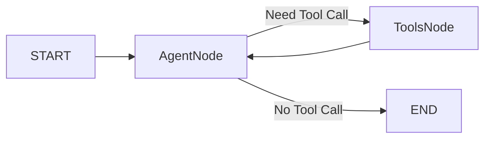
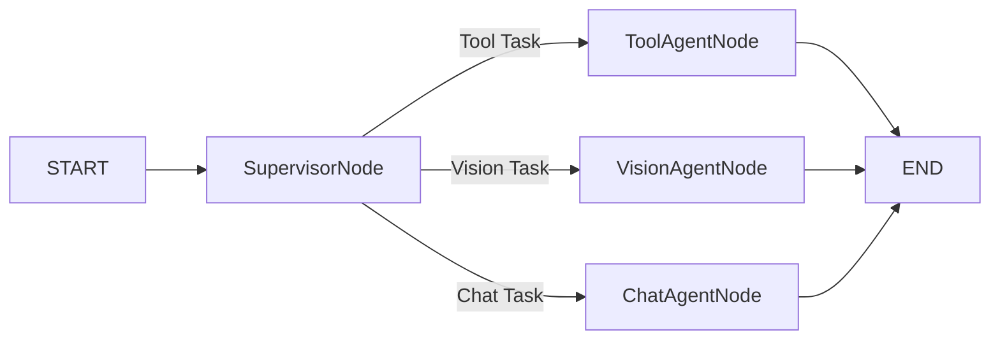

# AI Chatbot Server
An AI chatbot server that integrates external APIs, built-in knowledge, and vision capabilities while maintaining low latency. 

## Setup Instructions

### Prerequisites
- Node.js
- MongoDB
- A Gemini model API key from Google
- A Qwen model API 

### Installation
- Clone the repository:
```
git clone https://github.com/JamesPqz/MultiAgentChatbot.git
cd backend
npm i
```

- Configure environment variables:
```
cp .env.example .env
```

- Edit `.env` with your API keys and settings.
- Start MongoDB locally:
```
mongod --dbpath ./data
```

#### Build/Run the backend:
- npm run build / npm run dev
- The server will start on port 3000.

#### Build/Run the frontend:
```
cd frontend
npm i
npm run build
npm run dev
```

#### Docker deployment:
```
docker-compose down
docker-compose build --no-cache
docker-compose up -d
docker-compose ps
```
- Access the frontend at http://localhost:8080 .

### Testing
- Test health:
```
curl http://localhost:3000/health
```
- Expected response:
```
{"status":"ok","env":"docker","timestamp":"2026-05-06T03:35:49.453Z"}%  
```

- Send a test request:
```
curl -X POST http://localhost:3000/api/chat \
  -H "Content-Type: application/json" \
  -d '{"message": "Hello"}'
```
- Expected response:
```
{"success":true,"data":{"sessionId":"1778036896067_p3z9x380","response":"Hello! How can I help you today?","elapsedMs":2383}}%  
```

- Test agent with tool call:
```
curl -X POST http://localhost:3000/api/chat/agent \
  -H "Content-Type: application/json" \
  -d '{"message": "What is the weather in Hong Kong?"}'
```
- Expected response:
```
{"success":true,"data":{"sessionId":"1778036992110_jekezu9c","response":"Hong Kong: Showers, 27°C, humidity 80%.","elapsedMs":1751}}%  
```

- Test web search:
```
curl -X POST http://localhost:3000/api/chat/agent -H "Content-Type: application/json" -d '{"message": "Search for latest AI news"}'
```
- Expected response:
```
{"success":true,"data":{"sessionId":"1778037107061_kgy9r9cp","response":"Artificial Intelligence is transforming industries worldwide. Latest developments include multimodal models and agent-based systems.","elapsedMs":1795}}%  
```

- Test vision query:
```
curl -X POST http://localhost:3000/api/chat/agent \
  -H "Content-Type: application/json" \
  -d '{"message": "What color is this image?", "image": "data:image/png;base64,iVBORw0KGgoAAAANSUhEUgAAAAEAAAABCAYAAAAfFcSJAAAADUlEQVR42mP8z8BQDwAEhQGAhKmMIQAAAABJRU5ErkJggg=="}'
```
- Expected response:
```
{"success":true,"data":{"sessionId":"1778037268562_kvxu8psw","response":"The color of the image is a shade of **salmon** or **coral**. Its hexadecimal color code is approximately **#FA8072**.","elapsedMs":4141}}% 
```

- Test get history:
```
curl http://localhost:3000/api/history/session_xxx
```
- Expected response:
```
{"success":true,"data":{"sessionId":"1778037268562_kvxu8psw","history":[{"role":"user","content":"What color is this image?","timestamp":"2026-05-06T03:14:28.562Z","_id":"69fab2140075db3e745f4317"},{"role":"assistant","content":"The color of the image is a shade of **salmon** or **coral**. Its hexadecimal color code is approximately **#FA8072**.","timestamp":"2026-05-06T03:14:33.698Z","_id":"69fab2190075db3e745f431a"}]}}%   
```

- Test delete history:
```
curl -X DELETE http://localhost:3000/api/history/session_xxx
```
- Expected response:
```
{"success":true,"message":"History cleared","data":null}%   
``` 


- Test AB chat (single/multi/auto mode):
```
curl -X POST http://localhost:3000/api/ab-chat/chat -H "Content-Type: application/json" -d '{"message":"Hello","agentMode":"auto","stream":false}'
```
- Expected response:
```
{"success":true,"data":{"sessionId":"1778933321980_moh2nc2f","response":"Hello! How can I help you today?","variant":"A","latency":2649,"firstTokenLatency":2649,"elapsedMs":2673}}%  
```

- Test interrupt & resume interrupted operation:
```
curl -X POST http://localhost:3000/api/ab-chat/chat -H "Content-Type: application/json" -d '{"message":"delete file 1.txt","agentMode":"multi","stream":false}'
```
- Expected response:
```
{"success":true,"data":{"interrupted":true,"sessionId":"1778933472220_18lvtko0","message":"Operation requires confirmation. Please confirm via /resume endpoint."}}%  
```
```
curl -X POST http://localhost:3000/api/ab-chat/chat/resume -H "Content-Type: application/json" -d '{"sessionId":"1778933472220_18lvtko0","confirmed":true}'
```
- Expected response:
```
{"success":true,"data":{"sessionId":"1778933472220_18lvtko0","response":"File would be deleted: 1.txt","resumed":true}}%       
``` 


- Test AB test statistics:
```
curl http://localhost:3000/api/ab-chat/ab-test/stats
```
- Expected response:
```
{"success":true,"data":{"total":2,"variantA":{"count":2,"avgLatency":2538,"avgResponseLength":32},"variantB":{"count":0,"avgLatency":0,"avgResponseLength":0}}}%   
```

- Test clear AB test data:
```
curl -X DELETE http://localhost:3000/api/ab-chat/ab-test/clear
```
- Expected response:
```
{"success":true,"message":"AB test data cleared","data":null}%   
```

## API Endpoints

| Method | Endpoint                  | Description                      |
|--------|---------------------------|----------------------------------|
| POST   | /api/chat                 | Text chat without tools          |
| POST   | /api/chat/agent           | Full agent with tools and vision |
| GET    | /api/history/:sessionId   | Get chat history                 |
| DELETE | /api/history/:sessionId   | Clear chat history               |
| POST   | /api/ab-chat/chat         | AB test chat (single/multi/auto) |
| POST   | /api/ab-chat/chat/resume  | Resume interrupted session.      |
| GET    | /health                   | Health check                     |
| GET    | /api/ab-chat/ab-test/stats| Get AB test statistics           |
| DELETE | /api/ab-chat/ab-test/clear| Clear AB test records            |

### Response Format
- Refer to Testing

## Environment Variables

- Required variables:

| Variable       | Description                     |
|----------------|---------------------------------|
| GEMINI_API_KEY | Your Gemini API key             |
| MONGODB_URI    | MongoDB connection string       |
| QWEN_API_KEY   | Your Qwen API key               |
| QWEN_BASE_URL  | QWEN_BASE_URL                   |

- Optional variables:

| Variable           | Default                       | Description               |
|--------------------|-------------------------------|---------------------------|
| PORT               | 3000                          | Server port               |
| GEMINI_MODEL       | gemini-2.5-flash              | Model name                |
| GEMINI_VISION_MODEL| gemini-2.5-flash-lite         | Model name                |
| QWEN_MODEL         | qwen3.6-flash                 | Model name                |
| QWEN_CHAT_MODEL    | qwen3-coder-flash             | Model name                |
| QWEN_VISION_MODEL  | qwen-vl-plus                  | Model name                |
| GEMINI_TEMPERATURE | 0.3                           | Response randomness       |
| API_TIMEOUT_MS     | 2000                          | Timeout for external APIs |
| MODEL_TIMEOUT_MS   | 5000                          | Timeout for external APIs |

## Optimizations
- External API calls have timeout fallbacks to mock data
- MongoDB indexes on sessionId for fast history retrieval
- Docker health checks for service monitoring

## Considerations
- Real search APIs require additional API keys
- Mock data is used when real APIs timeout or keys are missing
- Chat history persists across sessions using sessionId
- AgentMode supports single / multi / auto (A/B test)
- Auto mode: Variant A = Gemini single agent, Variant B = Qwen multi-agent
- Sensitive tools require user confirmation via interrupt & resume flow
- AB test records latency, response length, and success rate

### Single-Agent Graph Structure


### Multi-Agent Graph Structure


## Interrupt Question Examples:
- Delete file: delete file test.txt → delete_file
- Send email: Send an email to test@example.com → send_email
- Confirm transfer: transfer 10000 USD to James → confirm_transfer
- Confirm risk: Invest $10000 in bitcoin → confirm_risk_acknowledgment
- Confirm identity: change my password to 12345 → confirm_identity_change

## Deployment
- Deployment reference: deploy.txt
- AWS access address: http://13.229.135.99